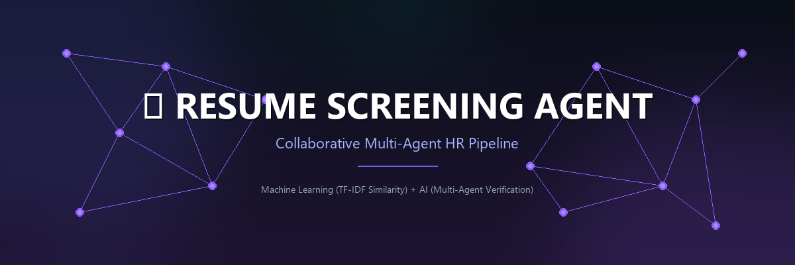

# 🚀 TalentStream AI: Collaborative Multi-Agent Resume Screening System



## 📖 Introduction & Cover Page

Welcome to **TalentStream AI** - a state-of-the-art collaborative Multi-Agent Resume Screening platform designed to automate, optimize, and audit candidate resume profiles against target Job Descriptions. 

This platform represents **honest engineering** designed to solve a critical HR challenge: screening candidates at scale while preventing AI score inflation, hallucinations, and parsing errors through cooperative, multi-step verification.

*   **Platform Version**: v1.0.0
*   **Target Core AI**: Gemini 3.5 Flash Model (`gemini-3.5-flash`)
*   **System Layout**: FastAPI (Python 3.11) Backend + Vite React (TypeScript) Frontend

---

## ⚡ Quick Start Details

Get the entire project running in **3 simple steps**:

1.  **Configure API Credentials**:
    *   Create a file named `.env` in the `backend/` directory.
    *   Paste your Gemini API key: `GEMINI_API_KEY=your_key_here`
2.  **Fire Up the Backend API**:
    *   Open your terminal in `backend/` and run:
        ```bash
        python -m venv .venv
        .\.venv\Scripts\Activate.ps1   # Windows
        pip install -r requirements.txt
        python -m uvicorn app.main:app --port 8000
        ```
3.  **Fire Up the Frontend Dashboard**:
    *   Open another terminal in `frontend/` and run:
        ```bash
        npm install --cache D:\npm-cache --no-audit --no-fund
        npm run dev
        ```
    *   Open your browser to `http://localhost:5173`.

---

## 🏗️ System Architecture & Workflow

Our agentic pipeline is built as a custom, lightweight workflow using Python and the official Google Gemini SDK. This ensures 100% control, maximum performance, and avoids complex framework overheads (like CrewAI or AutoGen) which are often slow or prone to dependency conflicts.

```
                  ┌────────────────────────────────────────┐
                  │   📥 User Uploads Resumes + Paste JD    │
                  └───────────────────┬────────────────────┘
                                      │
                                      ▼
                  ┌────────────────────────────────────────┐
                  │    📄 Backend Parser (PDF, DOCX, TXT)  │
                  └───────────────────┬────────────────────┘
                                      │
                                      ▼
                  ┌────────────────────────────────────────┐
                  │        🔍 Resume Parser Agent          │
                  │   Extracts structured candidate data   │
                  └───────────────────┬────────────────────┘
                                      │
                                      ▼
                  ┌────────────────────────────────────────┐
                  │      ⚖️ Candidate Review Agent         │
                  │ Matches skills & grades match (0-100)  │
                  └───────────────────┬────────────────────┘
                                      │
                                      ▼
                  ┌────────────────────────────────────────┐
                  │      🛡️ Quality Assurance Agent        │
                  │ Audits scores & experience timelines   │
                  └───────────────────┬────────────────────┘
                                      │
                                      ▼
                  ┌────────────────────────────────────────┐
                  │       👑 Ranking & Aggregator Agent    │
                  │ Ranks shortlist & drafts custom Qs     │
                  └───────────────────┬────────────────────┘
                                      │
                                      ▼
                  ┌────────────────────────────────────────┐
                  │      💻 Visual React Web Dashboard     │
                  └────────────────────────────────────────┘
```

### 🤖 The 4 Collaborative Agents
1.  **🔍 Resume Parser Agent (Extractor)**: Extracts standard fields (Name, Contact, Skills, Experience Years, Education, Work History) from raw document text into typed JSON.
2.  **⚖️ Review Agent (Evaluator)**: Scores candidates from 0 to 100 across 4 dimensions: Technical Skills, Experience, Education, and Role-specific Fit. Identifies pros, cons, and missing competencies.
3.  **🛡️ Quality Assurance Agent (Verifier)**: Reviews the evaluator's output to catch hallucinations and bias. It analyzes employment timelines to adjust scores if years of experience are overrated.
4.  **👑 Ranking & Aggregator Agent (Coordinator)**: Orders the candidates by score, writes a global batch review summary, and designs 3-4 custom technical and behavioral interview questions tailored to probe each candidate's gaps.

---

## 💻 How to Run the Platform

Here is the step-by-step procedure to boot the servers from scratch:

### 📂 Backend API Server Setup
1.  Navigate to the backend directory:
    ```bash
    cd backend
    ```
2.  Create the virtual environment:
    ```bash
    python -m venv .venv
    ```
3.  Activate the environment:
    *   **Windows (PowerShell)**:
        ```powershell
        .\.venv\Scripts\Activate.ps1
        ```
    *   **macOS / Linux**:
        ```bash
        source .venv/bin/activate
        ```
4.  Install the required dependencies:
    ```bash
    pip install -r requirements.txt
    ```
5.  Configure your environment file `backend/.env`:
    ```env
    GEMINI_API_KEY=your_gemini_api_key_here
    ```
6.  Start the FastAPI server:
    ```bash
    python -m uvicorn app.main:app --port 8000
    ```
    *   Check API health at: `http://localhost:8000/api/health`

### 💻 React Frontend Setup
1.  Open a new terminal window and navigate to the frontend folder:
    ```bash
    cd frontend
    ```
2.  Install packages (using the cache redirect to bypass space limits on C:):
    ```bash
    npm install --cache D:\npm-cache --no-audit --no-fund
    ```
3.  Boot the Vite development server:
    ```bash
    npm run dev
    ```
4.  Open the web dashboard: **`http://localhost:5173`**.

---

## 🧪 Sample Test Cases & Expected Outcomes

We have pre-configured a test directory containing **11 mock candidate resumes** of varying alignments. Run a test batch in the UI and verify that the scoring and recommendations match the expected classifications below:

| Candidate Name | File Name | Profile Type | Key Skills | Expected Score | Expected Recommendation |
| :--- | :--- | :--- | :--- | :---: | :---: |
| **Alice Smith** | [alice_smith_resume.txt](file:///d:/Projects/Resume%20Screening%20Agent/sample_resumes/alice_smith_resume.txt) | Senior Full-Stack | Python, FastAPI, React, TS, Docker, AWS | **90+** | **Shortlist** |
| **Kevin Baker** | [kevin_baker_resume.txt](file:///d:/Projects/Resume%20Screening%20Agent/sample_resumes/kevin_baker_resume.txt) | Mid Full-Stack | Python, FastAPI, React, TS, Docker | **80-89** | **Shortlist / Interview** |
| **Fiona Gallagher** | [fiona_gallagher_resume.txt](file:///d:/Projects/Resume%20Screening%20Agent/sample_resumes/fiona_gallagher_resume.txt) | Senior Backend | Python, FastAPI, PostgreSQL, Celery | **70-79** | **Interview** |
| **Helen Vance** | [helen_vance_resume.txt](file:///d:/Projects/Resume%20Screening%20Agent/sample_resumes/helen_vance_resume.txt) | Senior Frontend | React, Next.js, TypeScript, Vite | **65-75** | **Interview** |
| **Bob Jones** | [bob_jones_resume.txt](file:///d:/Projects/Resume%20Screening%20Agent/sample_resumes/bob_jones_resume.txt) | Data Scientist | ML, PySpark, Pandas, Airflow | **40-55** | **Reject** |
| **Evan Wright** | [evan_wright_resume.txt](file:///d:/Projects/Resume%20Screening%20Agent/sample_resumes/evan_wright_resume.txt) | DevOps Eng. | AWS, Kubernetes, Terraform, Ansible | **40-50** | **Reject** |
| **Charlie Brown** | [charlie_brown_resume.txt](file:///d:/Projects/Resume%20Screening%20Agent/sample_resumes/charlie_brown_resume.txt) | Junior Frontend | React, TailwindCSS, basic JS | **35-49** | **Reject** |
| **George Costanza** | [george_costanza_resume.txt](file:///d:/Projects/Resume%20Screening%20Agent/sample_resumes/george_costanza_resume.txt) | Junior Web Dev | HTML, CSS, Vanilla JS, Bootstrap | **15-30** | **Reject** |
| **Diana Prince** | [diana_prince_resume.txt](file:///d:/Projects/Resume%20Screening%20Agent/sample_resumes/diana_prince_resume.txt) | Project Manager | Jira, Agile, PMP (Non-coding) | **0-15** | **Reject** |
| **Ian Malcolm** | [ian_malcolm_resume.txt](file:///d:/Projects/Resume%20Screening%20Agent/sample_resumes/ian_malcolm_resume.txt) | Sysadmin | Linux, Server Rack, Bash Scripting | **0-15** | **Reject** |
| **Julia Robinson** | [julia_robinson_resume.txt](file:///d:/Projects/Resume%20Screening%20Agent/sample_resumes/julia_robinson_resume.txt) | UI/UX Designer | Figma, Sketch, Visual Prototyping | **0-10** | **Reject** |

### 📋 Step-by-Step Demo Flow
To conduct a demo screening run, follow these steps:
1.  **Open the Web App**: Launch your browser and navigate to `http://localhost:5173`.
2.  **Verify Backend Connection**: Confirm that the top-right indicator shows `● Agents Active`. If it shows an error, verify the backend is running.
3.  **Review the Job Description**: The dashboard pre-fills a standard **Senior Full-Stack Engineer** job description. You can leave it as is or customize it.
4.  **Upload Resumes**: 
    *   Click on the dashed uploader card or drag and drop files.
    *   Select candidates from the [sample_resumes/](file:///d:/Projects/Resume%20Screening%20Agent/sample_resumes) folder (e.g., select `alice_smith_resume.txt`, `fiona_gallagher_resume.txt`, and `diana_prince_resume.txt`).
5.  **Execute Screening**: Click the glowing **Run Multi-Agent Screening** button.
6.  **Monitor Live Agent Logs**: A log terminal will appear displaying the active steps from each agent in real-time.
7.  **Explore Final Dashboard**: 
    *   Review the candidate leaderboard ranked by final score.
    *   Select a candidate (e.g., *Alice Smith*) and explore their **Score Card & Fit** analysis, **Custom Interview Questions**, **QA Agent Transcript**, and **Parsed Profile**.
8.  **Export Results**: Click **Export JSON** to download a complete, structured JSON report of the screening task.

---

## 🛠️ Troubleshooting Guide

### 1. `type object 'dummy' has no attribute 'model_json_schema'`
*   **Cause**: The local Python virtual environment has Pydantic v1 installed, but the Google Gemini SDK expects Pydantic v2 to compile structured outputs.
*   **Solution**: Stop the uvicorn server and run:
    ```powershell
    .\.venv\Scripts\pip install "pydantic>=2.0.0"
    ```
    Verify it upgrades Pydantic successfully, then restart uvicorn.

### 2. `404 This model models/gemini-2.5-flash is no longer available`
*   **Cause**: The older `gemini-2.5-flash` model has been deprecated in Google AI Studio.
*   **Solution**: Double-check that [backend/app/agents.py](file:///d:/Projects/Resume Screening Agent/backend/app/agents.py) has `MODEL_NAME` set to `"gemini-3.5-flash"`. This points to the latest active model on your system.

### 3. Port `8000` is already in use (`only one usage of each socket address is permitted`)
*   **Cause**: A stale uvicorn/python process is running in the background from a previous execution.
*   **Solution**: Open PowerShell and terminate the stale process:
    ```powershell
    Get-NetTCPConnection -LocalPort 8000 -ErrorAction SilentlyContinue | Stop-Process -Id {$_.OwningProcess} -Force
    ```

### 4. `JavaScript heap out of memory` during frontend setup
*   **Cause**: Node.js has run out of memory during package unpacking because the C: drive is almost full, preventing the Windows paging file from growing.
*   **Solution**: Clean the npm cache and allocate a temporary cache directory on the D: drive:
    ```bash
    npm install --cache D:\npm-cache --no-audit --no-fund
    ```

---

## 📦 Assets & Folder Directory Structure

Here is the directory layout of the assets and code files in this workspace:

```
/Resume-Screening-Agent
  ├── assets/
  │    └── banner.png             # The high-resolution project banner image
  ├── backend/
  │    ├── app/
  │    │    ├── __init__.py       # Package marker file
  │    │    ├── main.py           # FastAPI server routers and threading pipeline
  │    │    ├── agents.py         # 4 Agents configurations (Parser, Evaluator, QA, Ranking)
  │    │    ├── parser.py         # File content text parsers (PDF, DOCX, TXT)
  │    │    └── schemas.py        # Pydantic data schemas representing outputs
  │    ├── .env                   # Local keys configuration (GEMINI_API_KEY)
  │    ├── .env.example           # Reference configuration variables file
  │    └── requirements.txt       # Backend Python packages file
  ├── frontend/
  │    ├── package.json           # Frontend framework version configurations
  │    ├── src/
  │    │    ├── App.tsx           # React UI core rendering logic
  │    │    ├── index.css         # Dark theme style sheets with glassmorphism
  │    │    └── main.tsx          # Client loader file
  │    └── vite.config.ts         # Vite bundler properties
  ├── sample_resumes/             # Folder containing the 11 mock candidate resumes
  ├── .gitignore                  # Global Git ignore specifications
  └── README.md                   # Complete system documentation
```

---

## 🌐 How to Link and Push this Project to GitHub

To upload this commit to your public GitHub profile:

1.  **Create a Repository on GitHub**:
    *   Go to [github.com/new](https://github.com/new).
    *   Enter a name for your repository (e.g. `Resume-Screening-Agent`).
    *   **Leave "Initialize this repository with" unchecked** (do not add a README, gitignore, or license).
    *   Click **Create repository**.
2.  **Run these commands in your PowerShell/Terminal**:
    ```powershell
    # Rename default branch to 'main'
    git branch -M main

    # Link your local project to your new GitHub repository
    # (Replace <username> and <repo> with your GitHub details)
    git remote add origin https://github.com/<username>/<repo>.git

    # Push files to your repository
    git push -u origin main
    ```

---

## 🔍 Codebase Explained Line-By-Line

Here is a complete, line-by-line and section-by-section breakdown of every source file in the project.

---

### 🐍 Backend: FastAPI Python Server

#### 📄 1. [backend/requirements.txt](file:///d:/Projects/Resume%20Screening%20Agent/backend/requirements.txt)
*   **Line 1 (`fastapi>=0.100.0`) 🌐**: Installs FastAPI, our web framework, which handles all API routing, data validation, and asynchronous features.
*   **Line 2 (`uvicorn>=0.22.0`) ⚡**: Installs Uvicorn, an ASGI (Asynchronous Server Gateway Interface) web server used to run the FastAPI app.
*   **Line 3 (`google-generativeai>=0.8.3`) 🧠**: Installs the Google Gemini Python SDK, allowing our backend to connect to Gemini models (`gemini-3.5-flash`) for agent analysis.
*   **Line 4 (`pypdf>=3.9.0`) 📂**: Installs PyPDF, a clean library used to read and extract text strings from PDF resumes.
*   **Line 5 (`python-docx>=0.8.11`) 📝**: Installs python-docx, which lets us parse text and tables out of Microsoft Word (`.docx`) resume formats.
*   **Line 6 (`python-multipart>=0.0.6`) 📥**: Enables FastAPI to parse incoming HTTP Multipart Form Data (necessary for handle uploading files).
*   **Line 7 (`python-dotenv>=1.0.0`) 🔑**: Installs python-dotenv to read and inject keys from our local `.env` configuration file into environment variables.
*   **Line 8 (`pydantic>=2.0.0`) 🛡️**: Installs Pydantic v2. Pydantic is used for request/response schemas and to enforce Gemini's structured JSON outputs.

---

#### 🧪 2. [backend/app/schemas.py](file:///d:/Projects/Resume%20Screening%20Agent/backend/app/schemas.py)
*   **Lines 1-2 📥**: Import `BaseModel` and `Field` from `pydantic` for writing fields, and `List`, `Optional` from `typing` for type annotations.
*   **Lines 4-11 (`CandidateProfile`) 👤**: Models the extracted resume details.
    *   `name` 📛: Enforces extraction of the candidate's full name.
    *   `email` / `phone` 📞: Enforces contact details.
    *   `skills` 🛠️: Extracts a list of matching/non-matching skills.
    *   `experience_years` ⏳: Compiles total years of experience as a float (e.g. 4.5).
    *   `education` 🎓: A list of academic credentials and degrees.
    *   `work_history` 💼: A list of past company names, roles, and employment durations.
*   **Lines 13-16 (`ScorecardCategory`) 📊**: Models individual grading criteria.
    *   `category` 🏷️: String identifying the graded subject (e.g., 'Technical Skills', 'Experience').
    *   `score` 💯: Float rating from 0 to 100.
    *   `reasoning` 💡: Explains how the score was calculated.
*   **Lines 18-26 (`EvaluationResponse`) 📝**: Models the Evaluator Agent's initial review draft.
    *   `candidate_name` 👤: Name of the candidate being graded.
    *   `overall_score` 📈: Aggregate overall rating.
    *   `categories` 🗂️: List of `ScorecardCategory` objects (the breakdown).
    *   `matching_skills` / `missing_skills` 🔍: Lists highlighting alignment and gaps.
    *   `pros` / `cons` ⚖️: bullet points highlighting strengths and limitations.
    *   `recommendation` 🔔: String recommendation (either 'Shortlist', 'Interview', or 'Reject').
*   **Lines 28-34 (`QAResponse`) 🛡️**: Models the Quality Assurance audit report.
    *   `candidate_name` 👤: Name of audited candidate.
    *   `original_score` 🔢: Evaluator's score.
    *   `adjusted_score` 📉: Final audited score (corrected by QA if discrepancies were found).
    *   `changes_made` ⚠️: Boolean flag marking if the QA adjusted the score or recommendation.
    *   `adjustments_summary` 📌: High-level list of modifications.
    *   `justification` 🧐: Deep audit logs explaining why the QA adjusted (or verified) the score.
*   **Lines 36-43 (`CandidateRankingDetail`) 👑**: Models individual item profiles in the final list.
    *   `rank` 🏆: Placement number (1 being the highest).
    *   `name` 👤: Candidate name.
    *   `overall_score` 💯: The final verified score.
    *   `recommendation` 📍: Final hiring recommendation.
    *   `summary` 💬: A 2-3 sentence overview of their profile alignment.
    *   `interview_questions` ❓: List of 3-4 custom questions designed to probe candidate gaps.
*   **Lines 45-48 (`BatchRankingReport`) 🗺️**: Models the global batch screening output.
    *   `job_description` 📄: Echoes the original JD text.
    *   `candidates` 👥: The sorted list of ranked `CandidateRankingDetail` records.
    *   `overall_summary` 🌟: Summary evaluation of the entire talent pool.

---

#### 💾 3. [backend/app/parser.py](file:///d:/Projects/Resume%20Screening%20Agent/backend/app/parser.py)
*   **Lines 1-3 📂**: Import `os` for path parsing, `pypdf` for reading PDFs, and `docx` for Word documents.
*   **Lines 5-16 (`parse_pdf`) 📄**: Extracts text from a PDF.
    *   Initializes empty `text` string.
    *   Creates a `pypdf.PdfReader` object using the file path.
    *   Loops through each page (`reader.pages`) and calls `page.extract_text()`, appending it to the accumulator.
    *   Catches exceptions and returns an error description.
*   **Lines 18-31 (`parse_docx`) 📝**: Extracts text from a Word document.
    *   Loads the Word file via `docx.Document(file_path)`.
    *   Creates a list of text paragraphs (`p.text for p in doc.paragraphs`).
    *   Iterates through any embedded tables, joining row cells using the pipe `|` symbol.
    *   Joins all paragraphs and tables using newlines (`\n`) to retain structure.
*   **Lines 33-38 (`parse_txt`) 💬**: Reads a plain text file.
    *   Opens the file using `encoding="utf-8"` and `errors="ignore"` to prevent crashes on non-standard Unicode characters.
*   **Lines 40-52 (`extract_text_from_file`) 🔌**: The primary router.
    *   Calls `os.path.splitext` to extract the file extension in lowercase.
    *   Routes `.pdf` to `parse_pdf`, `.docx` to `parse_docx`, and `.txt`/`.md`/`.json` to `parse_txt`. Falls back to reading as text if the extension is unknown.

---

#### 🧠 4. [backend/app/agents.py](file:///d:/Projects/Resume%20Screening%20Agent/backend/app/agents.py)
*   **Lines 1-8 🤖**: Import required modules (`os`, `json`, `logging` for logging, `google.generativeai` as `genai`, `dotenv`, and our Pydantic schemas).
*   **Lines 10-18 🔑**: Triggers `load_dotenv()` to read the `.env` file, configures the Gemini client with the key, and handles warnings if the key is missing.
*   **Lines 20-24 (`get_model`) 🧠**: Returns a `genai.GenerativeModel` instance using `gemini-3.5-flash` by default.
*   **Lines 26-62 (`ResumeParserAgent`) 🔍**: Parser agent class.
    *   `run()` accepts the raw document text.
    *   Constructs a system prompt instructing Gemini to act as a parser, extract contact details, work history, and skills.
    *   Calls `model.generate_content(...)`. It passes `response_mime_type="application/json"` and `response_schema=CandidateProfile` inside `GenerationConfig` to force Gemini to return valid JSON matching our Pydantic schema.
    *   Deserializes the response via `json.loads` and returns the `CandidateProfile` object.
*   **Lines 65-116 (`EvaluatorAgent`) ⚖️**: Evaluator agent class.
    *   `run()` takes the parsed profile JSON and the job description.
    *   Instructs Gemini to compare the candidate's skills against the JD and grade them on 4 core dimensions (Technical Skills, Experience, Education, Role Fit) from 0 to 100.
    *   Passes `response_schema=EvaluationResponse` to ensure a structured response.
*   **Lines 119-173 (`QualityAssuranceAgent`) 🛡️**: Quality assurance agent class.
    *   `run()` acts as an independent auditor. It takes the candidate profile, JD, and the evaluator's draft.
    *   Checks for inflated scores, hallucinated skills, or misalignments in work history timelines.
    *   Forces Gemini to return the structured `QAResponse` containing either adjusted scores or justifications verifying the original score.
*   **Lines 176-248 (`RankingAgent`) 👑**: Ranking and summary agent class.
    *   `run()` aggregates the evaluations of all candidates.
    *   Creates a lightweight summary list of all candidates' initial and QA-adjusted scores.
    *   Instructs Gemini to rank the pool, write a global summary, and draft 3-4 custom questions designed to probe matching gaps (e.g. asking a candidate claiming skills in a framework to explain how they used it if their tenure was short).
    *   Enforces structured schema `BatchRankingReport`. Includes fallback logic to sort candidates programmatically if the LLM call fails.

---

#### ⚡ 5. [backend/app/main.py](file:///d:/Projects/Resume%20Screening%20Agent/backend/app/main.py)
*   **Lines 1-13 📡**: Import web modules (FastAPI, UploadFile, BackgroundTasks, CORSMiddleware) and our agent classes.
*   **Lines 17-27 🌐**: Initializes the `FastAPI` instance and sets up CORS middleware to allow the frontend (running on port 5173) to communicate with the API.
*   **Lines 31-33 💾**: Sets up `TASKS_DB`, an in-memory dictionary to store task progress, logs, and screening results. Uses `threading.Lock` (`DB_LOCK`) to prevent race conditions during updates.
*   **Lines 35-42 (`TaskStatusResponse`) 📯**: Model representing task progress returned during client polling.
*   **Lines 44-162 (`run_screening_pipeline`) ⚙️**: The main background pipeline execution loop.
    *   Runs asynchronously in a background thread to prevent client timeouts during multi-resume evaluations.
    *   Instantiates the 4 agents (`ResumeParserAgent`, `EvaluatorAgent`, `QualityAssuranceAgent`, `RankingAgent`).
    *   Loops through uploaded files: parses text, runs the Parser Agent, runs the Evaluator Agent, runs the QA Agent, and appends the candidate record to the task database.
    *   Streams progress updates (e.g., `completed_count / total_files`) and logs to the task dictionary.
    *   Once all resumes are processed, it runs the `RankingAgent` to generate the final leaderboard, rankings, and interview questions.
    *   Sets task status to `completed` or `failed` accordingly.
*   **Lines 164-198 (`POST /api/analyze`) 📥**: Screening execution endpoint.
    *   Accepts a list of `UploadFile` files and the `job_description` string.
    *   Generates a unique `task_id` (UUID).
    *   Saves the uploaded files to a temporary folder (`temp_uploads/{task_id}`).
    *   Registers the task in `TASKS_DB` with status `processing`.
    *   Triggers `run_screening_pipeline` as a FastAPI `BackgroundTasks` thread and returns `{"task_id": task_id, "status": "processing"}` to the client.
*   **Lines 200-217 (`GET /api/status/{task_id}`) 📡**: Polling endpoint.
    *   Reads `TASKS_DB[task_id]` and returns the status, progress percentage, and logs for the frontend to display in real-time.
*   **Lines 219-234 (`GET /api/results/{task_id}`) 📊**: Results retrieval endpoint.
    *   Returns the finalized candidate profile, detailed scorecards, QA audits, and ranking reports once the task is marked `completed`.
*   **Lines 236-239 (`GET /api/health`) ❤️**: Backend health check.
    *   Returns the API status and whether the `GEMINI_API_KEY` is loaded.

---

### 💻 Frontend: React Web Dashboard

#### 📦 6. [frontend/package.json](file:///d:/Projects/Resume%20Screening%20Agent/frontend/package.json)
*   **Lines 6-11 (`scripts`) 🛠️**: Configures dev server command (`vite`), production compiler (`tsc && vite build`), and preview tools.
*   **Lines 12-15 (`dependencies`) 📦**: Installs React 18, React DOM 18, and `lucide-react` for beautiful SVG icons.
*   **Lines 16-25 (`devDependencies`) ⚙️**: Configures developer libraries including TypeScript compiler (`typescript`), types definitions, and Vite build engine (`vite`, `@vitejs/plugin-react`).

---

#### 🎨 7. [frontend/src/index.css](file:///d:/Projects/Resume%20Screening%20Agent/frontend/src/index.css)
*   **Line 1 🔤**: Imports Google Fonts: *Outfit* (for display headings) and *Plus Jakarta Sans* (for body text).
*   **Lines 3-23 (`:root`) 🎨**: Sets up HSL color variables for dark backgrounds, glowing purple/cyan primaries, status colors, and borders.
*   **Lines 25-40 🧼**: Basic resets and scrollbar styles to fit our dark-theme dashboard.
*   **Lines 42-61 (`.glow-orb`) 🔮**: Implements glowing background shapes using radial gradients and high blur filters to create a modern aesthetic.
*   **Lines 68-80 (`.glass-panel`) 💎**: Configures the core glassmorphic card style using translucent background colors, edge borders (`rgba(255,255,255,0.06)`), and background-blur filters (`backdrop-filter: blur(16px)`).
*   **Lines 82-127 🖱️**: Standardizes styles for form elements (textareas, buttons) with custom transitions and hover effects.
*   **Lines 129-146 (`.badge`) 🏷️**: Configures color-coded recommendation badges (Green for Shortlist, Yellow for Interview, Red for Reject).
*   **Lines 148-169 (`.score-circle`, `.log-terminal`) 📟**: Style classes for the custom SVG score circles and the scrolling terminal logger.
*   **Lines 172-208 🏁**: Layout classes (dashboard grids, pulse indicators, and navigation tabs).

---

#### 💻 8. [frontend/src/App.tsx](file:///d:/Projects/Resume%20Screening%20Agent/frontend/src/App.tsx)
*   **Lines 1-22 📦**: Imports React hooks and Lucide SVG icons.
*   **Lines 24-70 📂**: Declares TypeScript interfaces (`ScorecardCategory`, `Candidate`, `CandidateRankingDetail`, `RankingReport`) to match the backend API's JSON output.
*   **Lines 72-84 (`DEFAULT_JOB_DESCRIPTION`) 📄**: Pre-populates the UI with a Senior Full-Stack Engineer job description for easy testing.
*   **Lines 86-103 ⚙️**: Main component declaration and state initialization.
    *   `jobDescription` / `selectedFiles`: Stores the user's inputs.
    *   `taskId` / `status`: Tracks the backend screening progress.
    *   `progress` / `logs`: Tracks the streaming logs and progress percentage.
    *   `candidates` / `rankingReport`: Stores the finalized results.
    *   `selectedCandidateName`: Tracks the active candidate in the detail viewer.
    *   `activeTab`: Tracks the current detail view tab (Fit, Questions, QA, or Profile).
*   **Lines 105-117 🔄**: `useEffect` hooks to handle auto-scrolling the log terminal and cleaning up polling timers when the component unmounts.
*   **Lines 119-141 (`addFiles`, `removeFile`) 📤**: Event handlers for the drag-and-drop file uploader. Validates file extensions (`.pdf`, `.docx`, `.txt`, `.md`).
*   **Lines 143-188 (`handleStartScreening`) 🚀**: Triggers the screening run.
    *   Resets the state and prepares a `FormData` object containing the uploaded files and job description.
    *   Sends a `POST` request to `http://localhost:8000/api/analyze`.
    *   Saves the returned `task_id` and calls `startPolling()`.
*   **Lines 190-219 (`startPolling`) 📡**: Polls the backend status API.
    *   Triggers a `setInterval` query to `http://localhost:8000/api/status/{task_id}` every 1.5 seconds.
    *   Updates the progress bar and terminal logs in real-time.
    *   Clears the timer and calls `fetchResults()` once status is `completed`.
*   **Lines 221-243 (`fetchResults`) 📥**: Fetches results.
    *   Calls `http://localhost:8000/api/results/{task_id}` to retrieve candidate rankings.
    *   Selects the top candidate by default.
*   **Lines 245-272 (`handleReset`, `downloadJSON`) 💾**: Utilities to clear state and export the final report as a JSON file.
*   **Lines 274-297 📊**: Helper functions for calculating circular SVG progress bars and rendering status badges.
*   **Lines 299-361 (`Screen 1: Configurations`) ⚙️**: Renders the input configuration screen (job description input, drag-and-drop uploader, file list) and card overviews for the 4 agents.
*   **Lines 363-388 (`Screen 2: Pipeline logs`) 📟**: Renders the active screening progress bar, percentage counters, and the scrolling agent log terminal.
*   **Lines 390-410 (`Screen 3: Error logs`) ⚠️**: Renders pipeline error alerts and reset buttons.
*   **Lines 412-536 (`Screen 4: Leaderboard dashboard`) 🏆**: Renders the metrics summary cards (Total Candidates, Average Score, Top Candidate), the global batch review summary, and the candidate list sorted by rank.
*   **Lines 538-809 (`Screen 4: Candidate Detail Viewer`) 👤**: Renders the detail viewer for the selected candidate. Implements four tabs:
    *   **Scorecard & Fit**: Shows the categories breakdown (skills, experience, education, fit), matching and missing skills, pros and cons.
    *   **Custom Interview Questions**: Displays the 3-4 tailored questions generated by the Ranking Agent.
    *   **QA Agent Transcript**: Renders the QA Agent's audit trail, adjustments, and reasoning.
    *   **Extracted Profile**: Shows the parsed skills list, work history list, and education credentials.

---

## ✍️ Author Information

*   **Author**: Sneha Nuchha
*   **Email**: [snehanuchha@gmail.com](mailto:snehanuchha@gmail.com)


